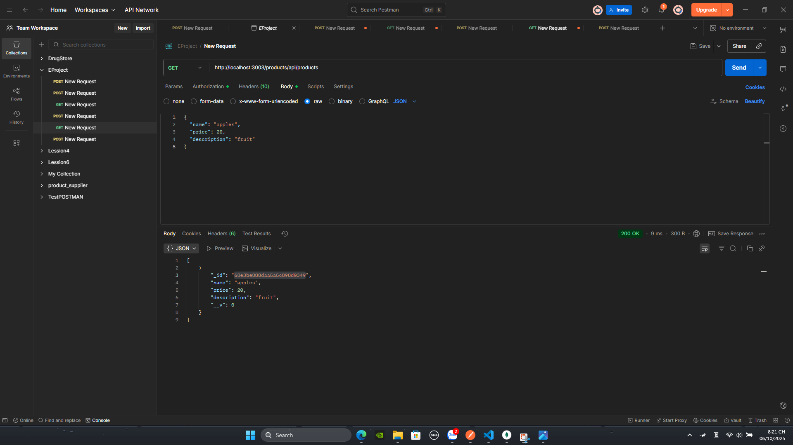

# README for EProject-Phase-1

## 1. Project Overview

EProject-Phase-1 is a project that implements user registration, login, and product management through a REST API. The project allows users to interact with products, make purchases, and view a dashboard.

## 2. Installation Instructions

To set up and run the project, follow these steps:

1. Install necessary dependencies using npm:
   ```bash
   npm install
   ```
2. Start the server:
   ```bash
   npm start
   ```

The server should be running on `http://localhost:3003`.

## 3.	Setup all microservices
### 3.1 Routing Requests to Different Microservices:

This snippet sets up an API Gateway to route requests to different microservices based on the URL path:

/auth requests are forwarded to the authentication service running on http://localhost:3000.

/products requests go to the product service at http://localhost:3001.

/orders requests are routed to the order service on http://localhost:3002.

The proxy ensures that each service is isolated, but they communicate through the gateway, making it easier to manage and scale services independently.

### 3.2 Setting Up the RabbitMQ Consumer

This part shows how to consume messages from RabbitMQ's orders queue.

It first establishes a connection to RabbitMQ using amqp.connect().

Then it creates a channel and ensures that the queue orders exists.

The consumer listens to the orders queue and processes the order data received, which might include products, usernames, and order IDs.

This setup allows the microservice to listen and respond to incoming orders, ensuring asynchronous communication between services.

### 3.3 Connecting to RabbitMQ and Setup in the Message Broker

The MessageBroker class handles the connection to RabbitMQ, similar to the previous code, but this time, it connects to the products queue.

The connection details (such as the RabbitMQ URI) are stored in the environment variables, ensuring that configuration is flexible and secure.

Once connected, the broker listens to the products queue and can process any messages related to product data.

## 4. Setting up the API

The following endpoints are provided for different functionalities:

- **POST** `/auth/register` - Register a new user.
- **POST** `/auth/login` - Login an existing user.
- **GET** `/auth/dashboard` - View the dashboard (requires authentication).
- **POST** `/products/api/products` - Create a new product.
- **GET** `/products/api/products` - Retrieve a list of products.
- **POST** `/products/api/products/buy` - Purchase a product and create an order.

## 5. Postman Test Instructions

Below are the steps to test the API using Postman, as shown in the images you uploaded.

### 5.1 Registering a User
- Method: **POST**
- URL: `http://localhost:3003/auth/register`
- Body (JSON):
  ```json
  {
    "username": "hung",
    "password": "123"
  }
  ```


### 5.2 Logging in
- Method: **POST**
- URL: `http://localhost:3003/auth/login`
- Body (JSON):
  ```json
  {
    "username": "hung",
    "password": "123"
  }
  ```


- The response will return a token which should be used in subsequent requests.

### 5.3 Accessing Protected Routes
- Method: **GET**
- URL: `http://localhost:3003/auth/dashboard`
- Headers:
  ```
  Key: x-auth-token
  Value: <JWT_TOKEN>  // Replace with the token received from login
  ```


### 5.4 Creating a Product
- Method: **POST**
- URL: `http://localhost:3003/products/api/products`
- Body (JSON):
  ```json
  {
    "name": "apples",
    "price": 20,
    "description": "fruit"
  }
  ```


### 5.5 Retrieving Products
- Method: **GET**
- URL: `http://localhost:3003/products/api/products`

### 5.6 Purchasing a Product
- Method: **POST**
- URL: `http://localhost:3003/products/api/products/buy`
- Body (JSON):
  ```json
  {
    "ids": ["<product_id>"]
  }
  ```


## 6. Conclusion

This README provides the basic setup and instructions for interacting with the EProject-Phase-1 API. You can use the Postman tool to test the different endpoints and verify the API functionality.
